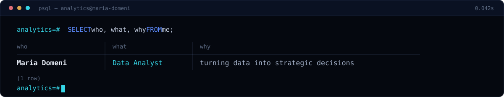
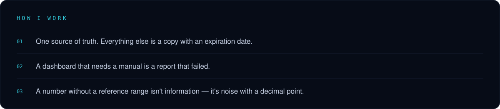
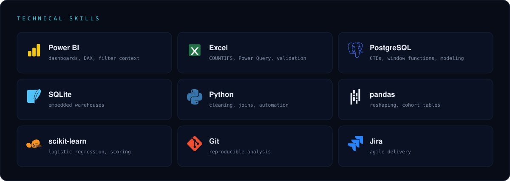
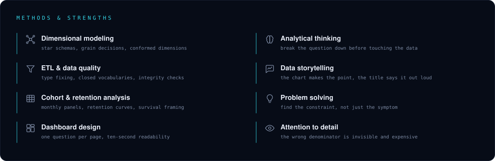

I've always been the person who asks where the number came from. Curiosity about data, business and how things actually work is what pulled me into analytics, and it's still the part I like most: the moment a messy spreadsheet turns into something a person can decide on.

I work the whole way through. I pull the data, model it, write the SQL, build the dashboard, then sit with the person who has to use it and check that the screen answers their question. If it doesn't, it isn't a dashboard. It's decoration.

---

São Paulo, BR · Portuguese | English | Spanish 

[LinkedIn](https://www.linkedin.com/in/mariaeduardadomeni/)

mariadomenidata@gmail.com
