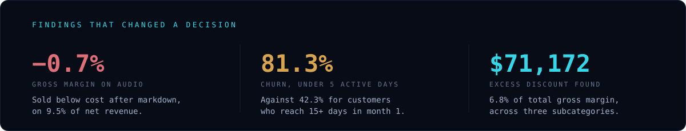
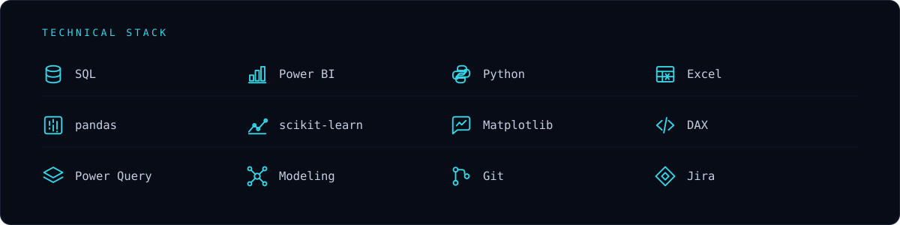

  

 

## Hi — I'm Maria

I've always been the person who asks where the number came from. A natural
curiosity about data, business and how things actually work is what pulled me
into analytics, and it's still the part I like most: the moment a messy
spreadsheet turns into something a person can decide on.

I work the whole way through — pull the data, model it, write the SQL, build
the dashboard, then sit with the person who has to use it and check that the
screen answers their question. If it doesn't, it isn't a dashboard. It's
decoration.

What I care about is the part most reports skip: the column that was silently
text instead of a date, the percentage averaged the wrong way, the status
field with three spellings of the same word. Those are the small failures that
quietly turn a good decision into a confident wrong one.

**Currently:** open to Data Analyst / BI Analyst roles · São Paulo, Brazil.

 

  

 

## Projects

Every figure below is reproducible — each repo ships the dataset, the queries
and a script that regenerates the numbers from scratch.

| Project | Stack | What it found |
| :--- | :--- | :--- |
| **[Retail Revenue & Margin Intelligence](https://github.com/maria-domeni/retail-margin-intelligence)** 19,596 order lines · 24 months · star schema | `SQL` `Power BI` `DAX` | Revenue grew 10.7% and margin didn't follow. **Audio sells below cost** — a 25.9% discount rate lands it at −0.7% gross margin on 9.5% of net revenue. Three subcategories carry **$71,172** of excess discount, 6.8% of total gross margin. |
| **[Subscription Churn & Retention](https://github.com/maria-domeni/subscription-churn-analytics)** 4,000 customers · 33,494 customer-months · logistic regression | `SQL` `Python` `scikit-learn` `Power BI` | **The first 30 days decide the outcome.** Under 5 active days in month one → 81.3% churn (vs 42.3%). Onboarding not completed → 72.8% (vs 43.9%). Two support tickets in month one → 62.2% (vs 33.8%). All three are visible by day 30. |
| **[Job Market Pipeline Tracker](https://github.com/maria-domeni/job-market-pipeline-excel)** 32 openings · 29 companies · self-updating funnel | `Excel` `COUNTIFS` `Data cleaning` | A posting-date column arrived as **text that looked like a date**. Every freshness filter returned zero and looked like a legitimate answer — the worst kind of bug, because nothing breaks. |

 

  

 

## How I work

> **One source of truth.** Everything else is a copy with an expiration date.
>
> **A dashboard that needs a manual is a report that failed.**
>
> **A number without a reference range isn't information** — it's noise with a
> decimal point.

Three habits that come from those:

- **Set the grain first.** Choosing a monthly panel over a status table is what
  turned a cohort triangle into a `GROUP BY` instead of a week of work.
- **Validate before analyzing.** Orphan keys, arithmetic integrity, impossible
  values — checked on every load. A report built on a silently broken load is
  worse than no report.
- **Never average a ratio.** `SUM(numerator) / SUM(denominator)`, always, so
  the percentage stays correct at every level someone drills into.

 

  

 

<b>Applied systems</b> — two builds where the analysis had to survive contact with daily operations

 

**Central Inbound** — a supply-chain control tower. Collections, receiving
plan, in-transit loads and stockout risk. The requirement was blunt: the team
keeps feeding the spreadsheet, the control tower updates itself. Purchase
orders and sales orders were split so the cross-check could raise a *demand
without coverage* alert on its own.

The lesson: a column-synonym dictionary solved in one afternoon what a naming
policy hadn't solved in a month. The people filling in the sheet were never
going to rename anything to fit my schema.

**Central Clínica** — practice management for a surgical clinic, with pricing
that comes from a calculation that closes instead of a guess with a margin on
top. Markup by divisor replaced cost-plus: on the reference procedure,
$1,300 at 14.1% real margin became $1,639 at exactly the 30% intended.

The lesson: the rule that *doesn't* fire matters as much as the one that does.
Stock alerts are suppressed for items that never had an intake — otherwise day
one arrives with 36 false alarms and nobody looks again.

 

## Reach me

| | |
| :--- | :--- |
| **LinkedIn** | [/in/mariaeduardadomeni](https://www.linkedin.com/in/mariaeduardadomeni/) |
| **Location** | São Paulo, Brazil · open to hybrid and remote |
| **Languages** | Portuguese (native) · English |

<!--
  TODO before this goes live — see LEIA-ME.md:
  1. Add your real email as a row above.
  2. Once the portfolio is deployed, add:
     | **Portfolio** | [maria-domeni.github.io](https://maria-domeni.github.io) |
-->

 

  Built by hand — the banner and every icon on this page are SVG in <code>assets/</code>, no badge services, no external requests.

